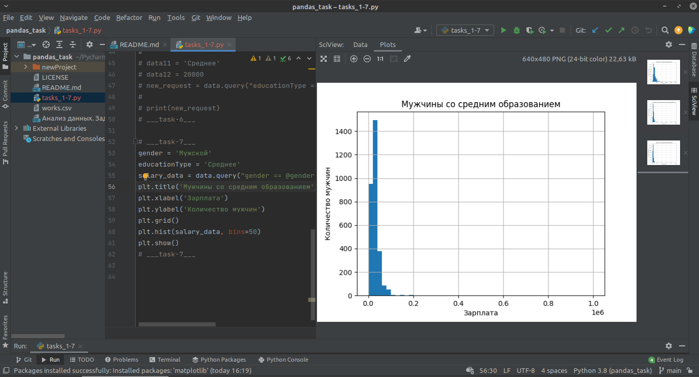

#REPORT

Графики для 7 задания:

(у мужчин пара графиков выводится с зарплатой не в тысячах рублей, а в [0;1] * 1e6. Как это исправляется, не нашел. Видимо дело в базе данных)

Зарплата мужчин:

Зарплата женщин:

